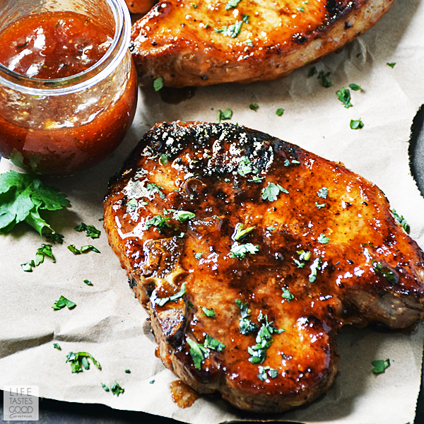

### Ingredients:

- Salt
- Garlic powder
- Black Pepper
- Chili powder
- Olive oil
- Butter
- 2x thick cut pork chops
- Brussels sprouts
- Apricot jam
- Ricotta

### Directions:

1. In a small pot melt butter on low heat. Add apricot jam and salt. Stir slowly until thin consistency. May add a little water to help thinning process.
2. Make a rub with salt, pepper, chili powder, garlic powder, and olive oil. Rub down the pork chops, and brush on 1/3 of the apricot sauce. Bake at 350 degrees for 30min. At 15min brush on another 1/3 of the apricot sauce.
3. Melt butter in another pot. Trim and halve Brussels sprouts, and add them into the pot with salt and garlic. Turn heat up to medium and cook Brussels sprouts until crispy brown, then mix in remaining 1/3 apricot sauce.
4. Turn down to low heat. Add scoops of the ricotta to the pot and let rest until serving.
