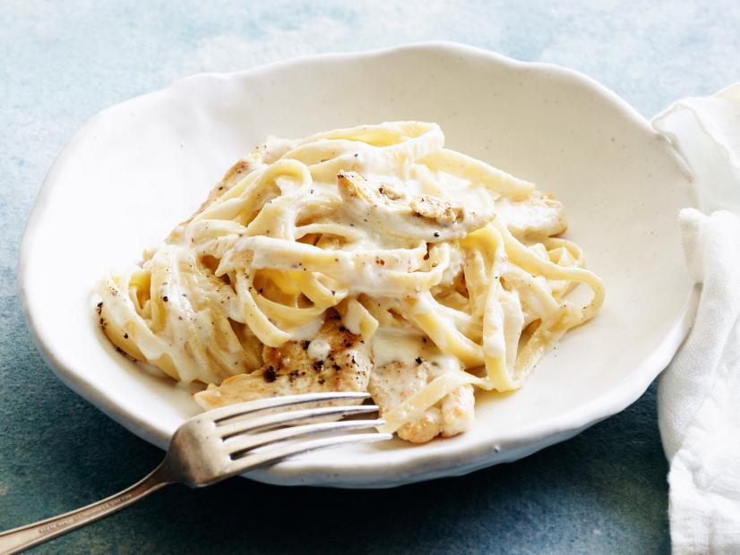

### Ingredients:

- Salt
- Black Pepper
- Garlic powder
- Chili powder
- Butter
- Olive oil
- Heavy whipping cream
- Shaved parmesan
- Tomatoes
- Onion
- Chicken breast

### Directions:

1. Add foil to a pan. Add a light amount of olive oil on pan. Cut tomatoes and onions, and add them along with the chicken to the pan. Add salt and garlic, then bake at 350 degrees for 30min.
2. In a sauce pan, melt butter, and lower heat. Add shaved Parmesan to the pan. Wait until the parmesan is starting to melt, then add a light amount of cream. Stir and add more cream until the sauce is the consistency that you want. Add the garlic powder and chili powder to sauce.
3. Prepare your pasta.
4. When chicken, tomatoes and onion are done, cut the chicken and add everything into the Alfredo sauce.
5. Add the pasta to the sauce and stir.
6. Serve topped with shaved parmesan and black pepper. Fresh basil leaves are welcomed as well.
