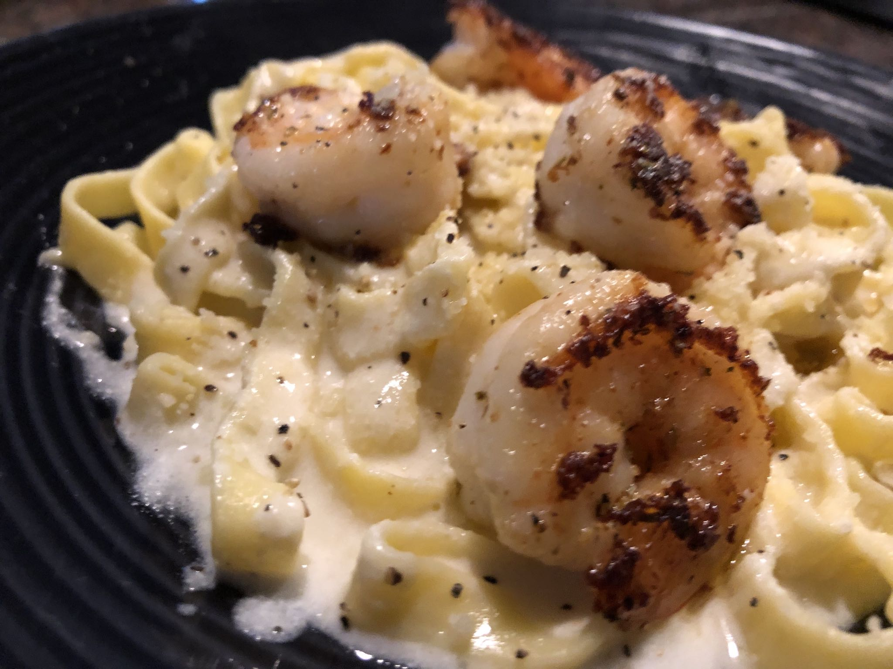

### Ingredients:

- Salt
- Garlic powder
- Chili powder
- Black Pepper
- Butter
- Coconut cream
- Heavy whipping cream
- Juice from 1/4 of fresh Lemon
- Shaved Parmesan
- Jumbo Shrimp

### Directions:

1. Prepare your pasta.
2. Add heavy whipping cream, coconut cream and shaved Alfredo to a pan. Add salt and be sure to stir every so often to cook sauce down.
3. In a new pan, melt butter. Add shrimp, salt, garlic powder, and chili powder. Add lemon juice and stir.
4. Pour everything from the shrimp pan into your sauce and leave at low heat.
5. Serve over pasta with black pepper.
